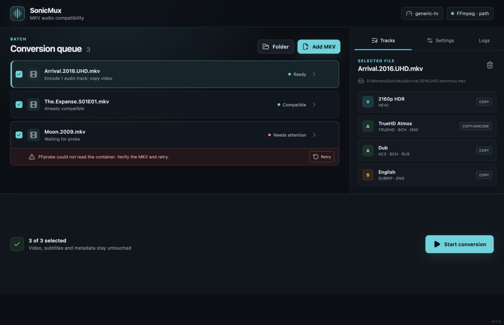

# SonicMux



SonicMux makes MKV audio playable on televisions and media renderers without
re-encoding video. It preserves original streams, metadata, chapters, and
attachments while changing only audio tracks that a selected device profile
cannot play. Remux-only mode can instead make a compatible track the default.

M7 adds a cross-platform Tauri desktop interface alongside the complete CLI and
keyboard-first terminal dashboard. All three use the same bounded scheduler.

## Problem → solution

Many televisions reject DTS, DTS-HD, or TrueHD even though they can display the
video in the same MKV. SonicMux copies that video unchanged and creates a
profile-compatible audio derivative such as AC-3, retaining the original audio
unless another output mode was explicitly selected.

## Requirements

- Windows, macOS, or Linux;
- FFmpeg and FFprobe together on `PATH`, or supplied with `--ffmpeg-path` or
  `SONICMUX_FFMPEG_PATH`;
- Rust 1.85 or newer when installing from source.

SonicMux does not download FFmpeg in CLI mode. Obtain it from an operating
system package manager or the [official FFmpeg download page](https://ffmpeg.org/download.html).

## Install from source

From a repository checkout:

```console
cargo install --path crates/cli --locked
cargo install --path crates/tui --locked
```

The installed executables are named `sonicmux` and `sonicmux-tui`.

Publication as `cargo install sonicmux-cli` is planned for the M8 release
milestone; it is not presented here as already available.

## Quick start

```console
# Inspect an MKV
sonicmux probe movie.mkv

# Preview the default AC-3 conversion without writing
sonicmux convert movie.mkv --dry-run

# Keep original audio and append compatible derivatives
sonicmux convert movie.mkv

# Convert a folder with up to four active files
sonicmux convert ./movies --recursive --jobs 4

# Make existing compatible English audio the default without encoding
sonicmux convert movie.mkv --remux-only --default-audio eng

# Scan recursively and return machine-readable results
sonicmux --json scan --recursive ./media

# Check the local FFmpeg toolchain
sonicmux doctor --print-paths
```

Use `sonicmux --help` and `sonicmux <command> --help` for the complete command
reference. Shell completions and a section-1 manual are generated by
`sonicmux completions` and `sonicmux man`.

## Terminal interface

Open the TUI with files, directories, or glob patterns, or start with an empty
queue and press `a` to add an input:

```console
sonicmux-tui ./movies --recursive
sonicmux-tui --dry-run movie.mkv
```

The four screens show the queue, tracks and planned actions, lifecycle logs, and
session settings. Use `j/k/g/G` or the arrow keys to navigate, `1`–`4` or Tab to
switch screens, `s` to start, `c` or Ctrl+C to cancel, `r` to retry failed
items, and `?` for the complete in-app key reference. Cancellation waits for
FFmpeg process reaping and staging cleanup before another batch can start.

The interface adapts to narrow terminals, preserves textual status labels when
`NO_COLOR` is set, and restores raw mode and the alternate screen on ordinary
errors and panics. Regenerate the demo with `docs/demo/record-m6.sh` after
installing [VHS](https://github.com/charmbracelet/vhs).

## Desktop interface

The SonicMux desktop app provides native file and folder pickers, Explorer or
Finder drag/drop, track inspection, conversion settings, progress, safe
cancellation, and explicit FFmpeg setup in one offline window.

Run it from a checkout with Node 24 and Rust 1.85 or newer:

```console
cd crates/gui
npm ci
npm run tauri dev
```

The application checks configured FFmpeg first, then a packaged sidecar pair,
then the system `PATH`. M7 does not yet distribute third-party FFmpeg payloads
or signed installers. See [desktop usage, development, and security](docs/gui.md)
and the [Windows-first manual checklist](docs/testing/m7-windows.md).

## Safety model

SonicMux accepts only Matroska `.mkv` inputs until the media core is stable. A
conversion is written into a private sibling staging directory, probed and
validated, synchronized, and then published with a non-replacing atomic rename.
An existing valid result is skipped. A conflicting result is never deleted or
overwritten. SonicMux intentionally has no `--overwrite` or `--in-place` option.

`--dry-run` performs discovery, probing, compatibility checks, planning, and
existing-output inspection without creating output files or directories.

## Parallel batches

`convert` first probes and plans inputs with bounded concurrency, checks for
duplicate destinations, and then executes ready files with the same bound. The
default is half the available logical CPUs, clamped to 1–4. Override it with
`--jobs N`, `SONICMUX_JOBS`, or `[scheduler].jobs`.

Storage profiles provide conservative defaults when no explicit job count wins:

- `hdd`: one active file;
- `balanced`: computed 1–4 default;
- `nvme`: computed 1–4 default and an explicit SSD intent marker.

One file failure does not stop unrelated work. `--fail-fast` instead stops new
admission and cancels active files, waiting for FFmpeg process groups and private
staging files to be cleaned. Final JSON results always retain discovery order,
even when files finish out of order.

## Configuration and automation

Configuration is strict, versioned TOML. Precedence is command line,
`SONICMUX_*` environment, selected file, then defaults. Start with:

```console
sonicmux config init
sonicmux config show --sources
```

The generated file includes:

```toml
[scheduler]
# jobs = 2
storage-profile = "balanced"
```

`--json` produces one versioned result document. `--json-progress` produces
newline-delimited lifecycle events for `probe`, `scan`, and `convert`.
Diagnostics and progress use stderr; result data uses stdout. Exit codes are
documented in [docs/cli.md](docs/cli.md).

| Code | Meaning |
| ---: | --- |
| 0 | All requested work succeeded or was validly skipped |
| 1 | A multi-file batch completed with one or more failures |
| 2 | Invalid arguments or configuration |
| 3 | FFmpeg/FFprobe discovery or capability failure |
| 4 | Input discovery or probe failure |
| 5 | Planning failure |
| 6 | Execution, validation, or safe publication failure |
| 130 | Cancelled after process reaping and staging cleanup |

## M5 benchmark

This is a local synthetic measurement, not a universal speed claim. Four copies
of one generated 20-second MKV were converted from six-channel DTS to AC-3 in
`add` mode. Each input was 35,975,929 bytes (MPEG-4 video, DTS audio), for
143,903,716 input bytes per batch.

| Jobs | Mean ± σ | Range | Relative |
| ---: | ---: | ---: | ---: |
| 1 | 937.7 ± 30.9 ms | 910.2–986.2 ms | baseline |
| 4 | 295.8 ± 26.9 ms | 261.2–330.2 ms | 3.17× faster in this run |

Measurement environment: release build at commit `6e34c65`, Apple M2 (8 cores),
8 GiB RAM, arm64 macOS 26.5.2, internal Apple SSD with APFS, FFmpeg 8.1.1, and
hyperfine 1.20.0. Hyperfine used one warmup and five measured runs; output files
were removed before every command. Fixture SHA-256:
`6278babeb8cca952a6632319d31659ab302d1df45eb0231231c2435dbbf092cf`.
An HDD result was not measured and is not inferred from the SSD result.

Reproduce the synthetic fixture and benchmark with
`benchmarks/generate-m5-fixture.sh` and `benchmarks/run-m5.sh`. The runner keeps
its temporary workspace so the measured inputs, outputs, and JSON results can be
inspected.

## Current limitations

- MKV input/output only;
- hybrid configured/sidecar/system FFmpeg resolution for the GUI, without a
  redistributable sidecar payload yet;
- no replacing transaction, updater, signed installers, or release binaries yet.

## License

Licensed under either Apache-2.0 or MIT, at your option. FFmpeg is an external
tool and retains its own licensing terms.

## Acknowledgements

SonicMux uses FFmpeg/FFprobe for media processing and the Rust open-source
ecosystem for its portable application layers.
