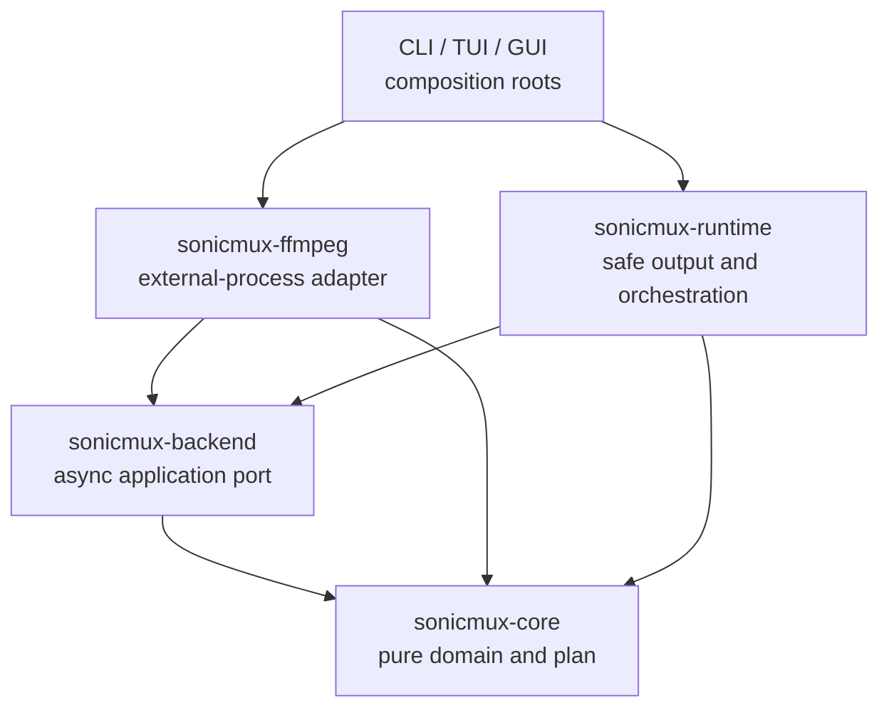

# ADR-0005: Put the media backend port in a dedicated crate

- Status: Proposed
- Date: 2026-08-11

## Context

ADR-0001 placed the `MediaBackend` trait at the application/runtime boundary.
The M0 dependency sketch also made `sonicmux-runtime` depend directly on
`sonicmux-ffmpeg`. Implementing the trait literally inside runtime would require
`sonicmux-ffmpeg` to depend back on runtime, creating a Cargo dependency cycle.

The trait cannot live in `sonicmux-core`: its async process and cancellation
contract would make the pure domain crate depend on Tokio-oriented types. Putting
the trait in `sonicmux-ffmpeg` would make the concrete adapter own the application
port and would force mocks and future adapters to depend on FFmpeg-specific code.

## Decision

Add a small `sonicmux-backend` workspace crate. It owns only the object-safe media
port and the transport-neutral types crossing that port:

- `MediaBackend`;
- `BackendExecution`;
- `ProgressEvent` and its fixed-point value types;
- `BackendReport`;
- the categorized application-facing `BackendError`.

The crate depends on `sonicmux-core`, `async-trait`, Tokio's bounded channel
types, and `tokio-util::sync::CancellationToken`. It does not know FFmpeg command
arguments, filesystem transaction rules, scheduling, configuration, or any UI.



UI crates do not call FFmpeg methods. Their composition roots construct a
concrete adapter and inject `Arc<dyn MediaBackend>` into runtime. Runtime tests
inject a mock implementing the same port.

The port uses `async-trait` because native async trait methods are not currently
dyn-compatible. Concrete FFmpeg methods retain typed `ProbeError` and
`ExecutionError` values for adapter tests; the trait implementation maps them to
a categorized `BackendError` with a boxed `Send + Sync` source. Cancellation is
a distinct variant and is never inferred by matching an error string.

An owned execution request avoids borrowed-lifetime constraints when a job is
spawned:

```rust
pub struct BackendExecution {
    pub plan: Arc<JobPlan>,
    pub staging_path: PathBuf,
}

#[async_trait]
pub trait MediaBackend: Send + Sync {
    async fn probe(
        &self,
        path: &Path,
        cancel: CancellationToken,
    ) -> Result<MediaInfo, BackendError>;

    async fn execute(
        &self,
        request: BackendExecution,
        progress: mpsc::Sender<ProgressEvent>,
        cancel: CancellationToken,
    ) -> Result<BackendReport, BackendError>;
}
```

`staging_path` is deliberately separate from `JobPlan::output()`: the plan owns
the requested final destination, while runtime alone owns the temporary-file
transaction. A backend must write only to the staging path it is given.

## Consequences

- The workspace remains acyclic and both runtime and the FFmpeg adapter can be
  tested independently.
- The pure core remains free of async/runtime dependencies.
- Adding a linked or remote backend does not make runtime depend on a concrete
  implementation.
- A small additional published crate becomes part of the public workspace.
- On acceptance, the dependency diagram and workspace tree in
  `docs/architecture.md` and the trait-location wording in ADR-0001 will be
  amended without changing their original media-backend decision.
