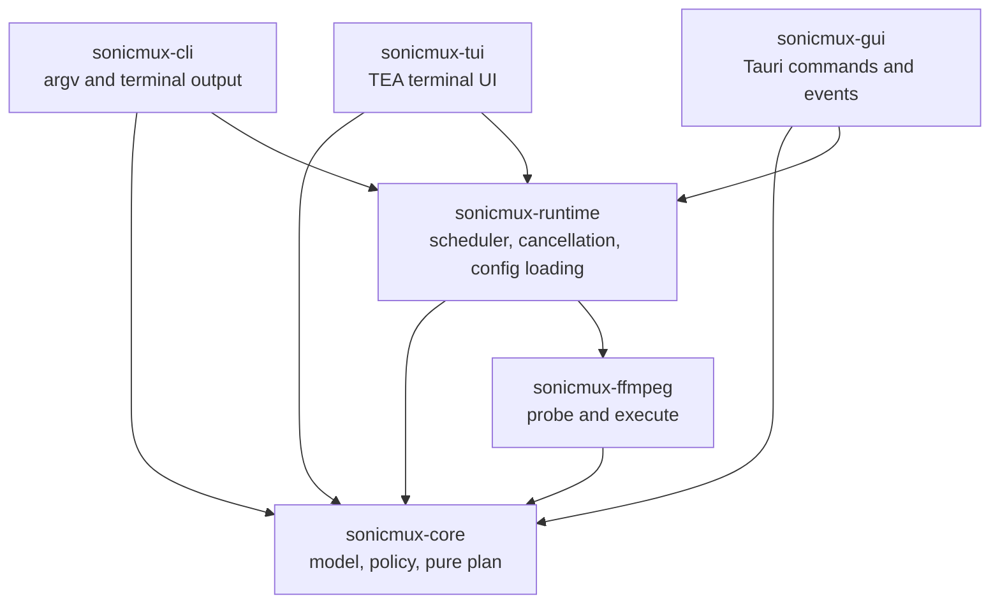
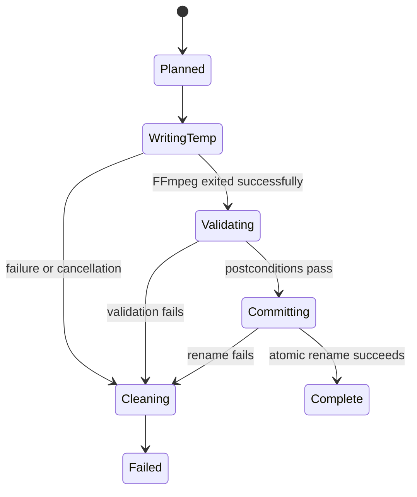
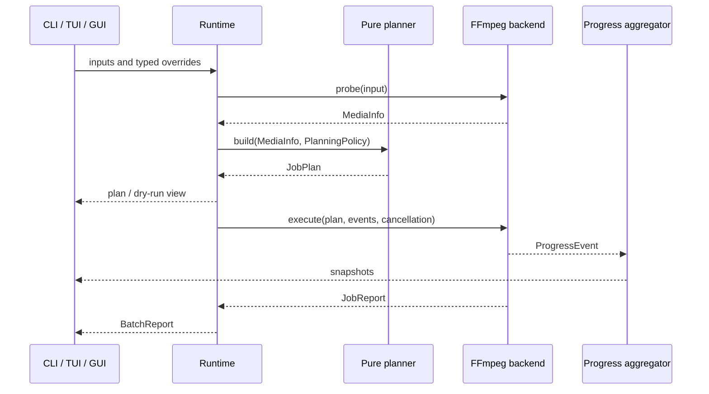

# SonicMux architecture

- Status: Accepted
- Date: 2026-08-10

## Product decisions

| Topic | Decision |
| --- | --- |
| Product name | SonicMux (`sonicmux` on crates.io) |
| Delivery order | CLI first, then TUI, then GUI |
| GUI platforms | Linux, Windows, macOS; Windows is the first manual validation target |
| FFmpeg delivery | System dependency for CLI/TUI; pinned sidecar with system fallback for GUI |
| Containers | Matroska (`.mkv`) only until the core is stable |
| Remux fast path | Included; an existing compatible track can be made default without transcoding |
| Publishing | crates.io and GitHub Releases |
| Project license | `MIT OR Apache-2.0` |

The M0 documents use the date of the design decision. Crate names and dependency
versions will be checked again when M1 begins because registry state can change.

## Goals and boundaries

SonicMux turns incompatible audio in an MKV into television-compatible audio
without re-encoding video or subtitles. It preserves stream metadata, chapters,
attachments, and timing. One domain planner is shared by CLI, TUI, and GUI.

The initial product does not:

- encode video or subtitles;
- modify MP4, MPEG-TS, or other containers;
- edit media in place without a retained backup;
- normalize loudness by default;
- download FFmpeg automatically;
- guess device capabilities from a television model database;
- promise bit-exact container output. Stream copy preserves encoded payloads,
  while Matroska container structure and metadata ordering can change.

## Architectural invariant

The main invariant is a pure, deterministic planner:

```rust
pub fn build(media: &MediaInfo, policy: &PlanningPolicy)
    -> Result<JobPlan, PlanError>;
```

For equal typed inputs it returns an equal plan, performs no filesystem or
environment access, reads no configuration files, runs no process, and has no
clock or random dependency. All device compatibility, track selection, output
mode, downmix, metadata, disposition, and stream mapping decisions are visible
in `JobPlan` and testable without FFmpeg.

This is stronger than placing every feature in a crate named `core`. The process
backend and asynchronous scheduler therefore live in separate crates.

## Dependency direction



`sonicmux-core` never depends on another workspace crate. UI crates never invoke
FFmpeg directly. The runtime depends on a backend interface and can use a mock in
tests.

## Proposed workspace

```text
sonicmux/
├── Cargo.toml
├── rust-toolchain.toml
├── crates/
│   ├── core/                 # Domain model, policy, plan, typed effective config
│   │   └── src/
│   │       ├── model.rs
│   │       ├── policy.rs
│   │       ├── plan.rs
│   │       └── config.rs
│   ├── ffmpeg/               # ffprobe parser and FFmpeg CLI adapter
│   │   └── src/
│   │       ├── probe.rs
│   │       ├── command.rs
│   │       ├── progress.rs
│   │       └── process.rs
│   ├── runtime/              # Backend interface, queue, config sources, safe output
│   │   └── src/
│   │       ├── backend.rs
│   │       ├── scheduler.rs
│   │       ├── output.rs
│   │       └── config.rs
│   ├── cli/
│   ├── tui/
│   └── gui/
│       ├── src-tauri/
│       └── web/
├── xtask/
├── docs/adr/
├── testdata/                 # Generation scripts, not committed media binaries
└── tests/fixtures/           # Small JSON/text protocol fixtures
```

Package names are `sonicmux-core`, `sonicmux-ffmpeg`, and so on. The installed
CLI binary is `sonicmux`; the TUI binary is provisionally `sonicmux-tui`. The GUI
uses the display name SonicMux.

## Domain model sketch

Identifiers and quantities are typed so invalid unit combinations do not enter
the planner:

```rust
pub struct StreamIndex(u32);
pub struct Bitrate(u32);             // bits per second
pub struct Language(String);         // normalized BCP 47 or retained source value
pub struct Duration(std::time::Duration);

pub enum StreamInfo {
    Video(VideoStream),
    Audio(AudioStream),
    Subtitle(SubtitleStream),
    Attachment(AttachmentStream),
    Data(DataStream),
}

pub enum AudioCodec {
    Ac3,
    Eac3,
    Aac,
    Mp3,
    Dts,
    DtsHd,
    TrueHd,
    Other(String),
}

pub enum AudioTarget {
    Ac3 { bitrate: Bitrate, layout: TargetLayout },
    Eac3 { bitrate: Bitrate, layout: TargetLayout },
    Aac { bitrate: Bitrate, layout: TargetLayout },
}

pub enum OutputMode { Add, Replace, OnlyNew }
pub enum JobAction { Transcode, RemuxOnly, Skip }
```

Growing public enums will be `#[non_exhaustive]`. Raw ffprobe values are parsed
into adapter DTOs and converted into the domain model with fallible validation.
Unknown values are retained where safe instead of causing a panic.

`MediaInfo` contains format duration, streams in source order, chapters, global
tags, and the source path. Audio streams include codec/profile, channel count and
layout, bitrate when known, language, title, dispositions, and timing fields.

`JobPlan` contains no preformatted shell string. It records typed input/output
paths, action, ordered output stream mappings, per-stream copy/encode operation,
metadata/disposition changes, expected validation facts, and a stable plan
fingerprint. The FFmpeg adapter alone converts this representation to arguments.

## Policy and planning

`PlanningPolicy` is the fully merged input to the planner:

```text
PlanningPolicy
├── compatibility profile
├── target codec, bitrate, and layout
├── output mode
├── remux-only selection, when requested
├── output naming and collision policy
└── metadata/disposition rules
```

Initial named profiles are `generic-tv`, `samsung`, `lg`, and `dlna`. Until
verified compatibility matrices exist, vendor profiles must not pretend to know
every device generation. They begin as documented conservative presets and can
be overridden by a `custom` policy.

Planner algorithm:

1. Reject a non-Matroska input and structurally invalid media information.
2. Classify every audio stream against the active compatibility profile.
3. If remux-only was explicitly requested, select an existing compatible audio
   stream, update dispositions in the plan, and encode nothing.
4. Otherwise create an output operation for each source stream according to the
   selected output mode.
5. Preserve every non-audio stream with stream copy. Preserve chapters,
   attachments, global metadata, per-stream metadata, and supported disposition
   flags.
6. For every encoded derivative, copy language and source title, append a
   deterministic codec/layout suffix to its title, and apply ADR-0003's default
   rule.
7. Reject a plan that would have no audio or overwrite its own input outside the
   in-place transaction.
8. Produce expected postconditions for output validation and a dry-run view.

The planner does not infer a stream relationship from language alone. Every new
track points to its exact source `StreamIndex`.

## Stream and metadata invariants

- Video uses stream copy; no video encoder option may be generated.
- Subtitles, attachments, and data streams use stream copy when the Matroska
  muxer supports them.
- Chapters and global metadata are mapped from the source.
- Compatible audio uses stream copy unless `only-new` intentionally omits it.
- Every encoded audio track inherits source language and relevant metadata.
- Only explicitly planned disposition differences are allowed.
- Input timestamps are preserved as far as FFmpeg's Matroska demux/mux pipeline
  permits. Negative timestamps, start offsets, and codec delay need fixtures.
- Validation compares codec type, stream counts/mappings, language, title,
  dispositions, chapters, and attachments against plan postconditions.
- M3 additionally verifies copied video packet payload hashes, not whole-file
  hashes, because remuxing changes the container.

Preservation claims are limited to fields exposed and correctly remuxed by the
selected FFmpeg version. Unsupported Matroska elements must produce a warning in
the report rather than being silently claimed as preserved.

## Safe output state machine

The default output is `<stem>.sonicmux.mkv` next to the source or inside
`--output-dir`. Processing never writes directly to the final path.



The temporary file is created on the same filesystem and in the final output
directory so the final rename is atomic for the supported local filesystem.
Its name includes an unguessable component and ends in `.tmp.mkv`. A guard owns
the path until commit.

If a final output already exists, SonicMux probes it. It is skipped only when it
matches the current plan postconditions and fingerprint; otherwise the command
fails unless the user explicitly selects overwrite. Overwrite is never implied
by `--yes`.

For `--in-place`, after output validation SonicMux renames the source to
`<name>.bak`, then renames the validated temporary file to the original name.
The backup is retained. This two-rename sequence cannot be globally atomic, so
the runtime records and detects recoverable interrupted states. Existing backup
paths cause a preflight error. Symlinks and non-local filesystems are not followed
into an in-place transaction without an explicit future design.

## Configuration

Precedence is:

```text
CLI flags > SONICMUX_* environment > selected TOML config > defaults
```

Each source is parsed into typed partial overrides. Pure merge and validation
produce `PlanningPolicy` and `RuntimeConfig`. A CLI parser never appears in core,
and the core never reads process environment or files.

Default config locations follow platform conventions. `--config PATH` selects
one explicit file. Unknown keys are errors by default so misspellings do not
silently change conversion behavior. Secrets are not expected in the config.

## Runtime and event flow



The CLI renders `indicatif` progress only on a TTY. The TUI uses an Elm-style
`Model / Msg / update / view` loop and restores the terminal on normal exit,
error, cancellation, and panic. The GUI exposes narrow Tauri commands, emits
progress events, and grants filesystem access only to user-selected paths.

## Error and observability model

Core exposes typed `thiserror` errors. Binary boundaries add human context with
`color-eyre` or `anyhow`. Errors identify the input and phase without embedding
unbounded FFmpeg output.

Tracing is structured from M1. Human logs go to stderr and an optional rotating
file; machine output remains on stdout. Paths are logged because they are needed
for batch diagnosis, but environment contents and arbitrary media metadata are
not dumped at normal verbosity.

No production path uses `unwrap`, `expect`, or panic for user-controlled data.
Workspace crates forbid unsafe code. A future linked FFmpeg adapter would need a
separate, documented exception.

## Test strategy by boundary

| Boundary | Test approach |
| --- | --- |
| Domain model and policy | Unit tests and property tests without filesystem access |
| Planner | At least 20 unit cases plus `insta` snapshots of `JobPlan` |
| ffprobe protocol | Checked-in JSON fixtures, malformed/unknown-value tests |
| FFmpeg arguments | Snapshots of argument arrays, never shell strings |
| Runtime | Mock backend tests for limits, cancellation, partial failures, cleanup |
| End-to-end | Generated five-second media fixture when required codecs are available |
| CLI | `trycmd`/`assert_cmd`, JSON schema, exit-code behavior |
| TUI | Pure update tests plus terminal restoration integration test |
| GUI | Command contract tests, capability audit, three-platform builds |

Every implementation milestone ends with format, Clippy with warnings denied,
and workspace tests. CI also checks the fixed MSRV, documentation, dependency
licenses/advisories, and feature combinations as introduced.

## M0 approval points

Approval of M0 accepts both the seven product decisions above and these detailed
semantics:

1. `only-new` removes all original audio and errors with `NothingToDo` when no
   incompatible track needs a derivative.
2. In `add` mode, a new derivative takes the `default` flag from its incompatible
   default source; if none was default, the first derivative becomes default.
3. Remux-only is explicitly requested and never silently substitutes for an
   `add` or `replace` conversion.
4. Default output naming is `<stem>.sonicmux.mkv`.
5. In-place mode always retains `<name>.bak`; it is not the default.
6. The extra `ffmpeg` and `runtime` crates enforce the clean-core dependency
   boundary.
