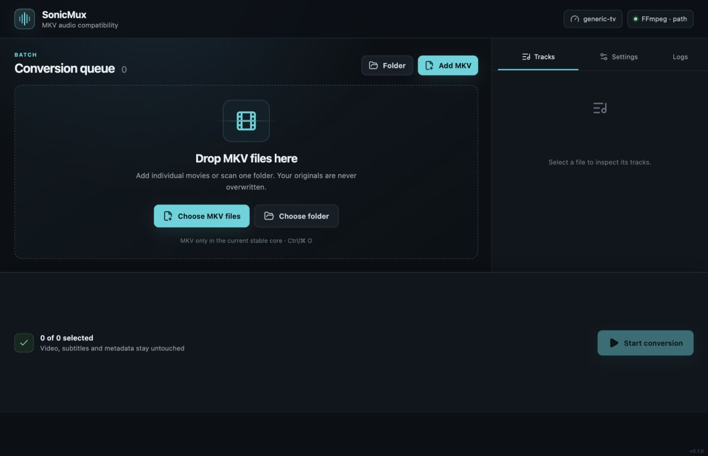
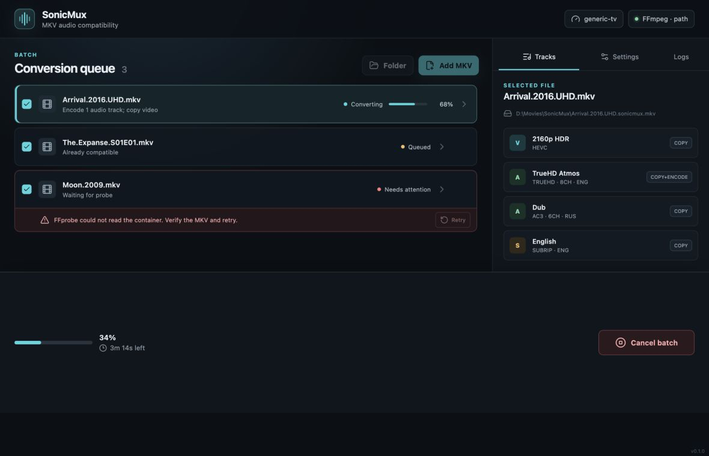
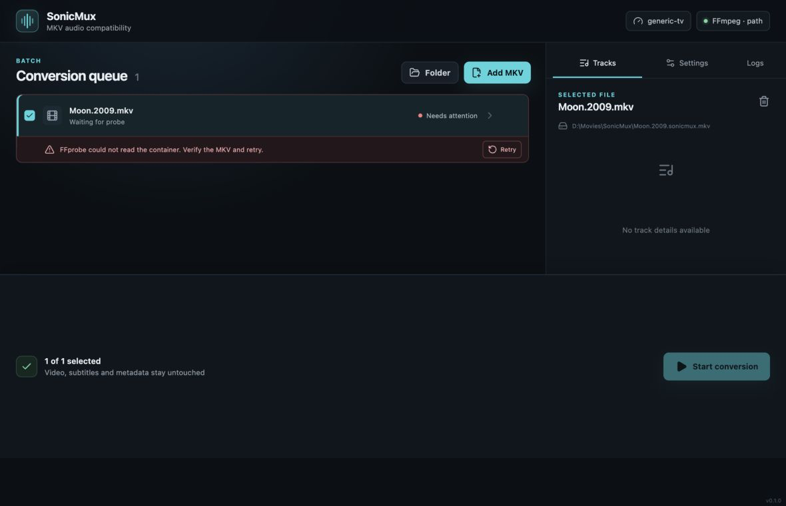
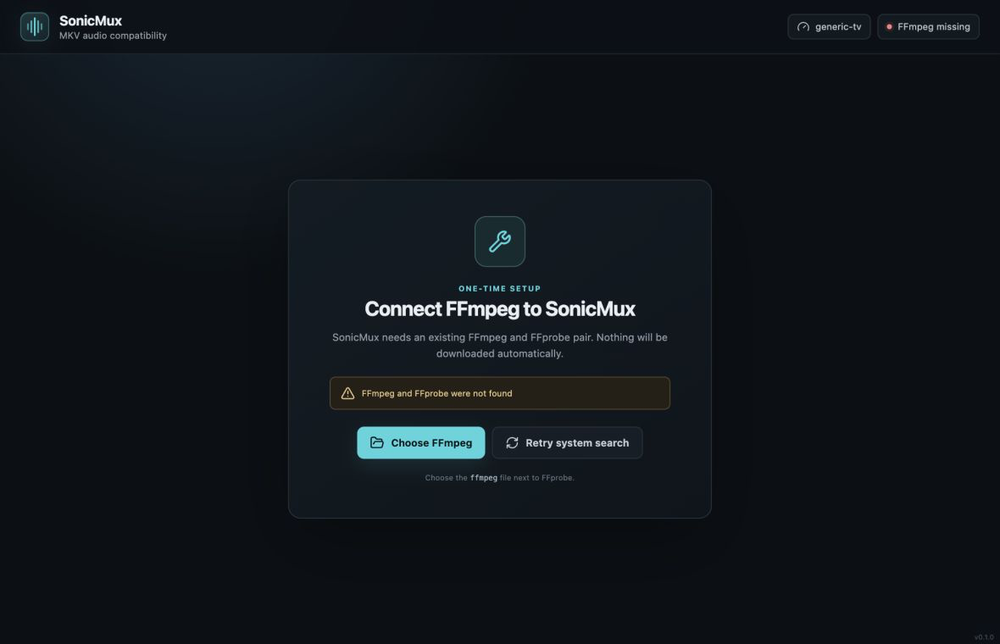

# Desktop interface

SonicMux M7 adds one offline desktop window for Windows, macOS, and Linux. It
uses the same MKV-only planner, safe output transaction, and bounded scheduler
as the CLI and TUI. Windows is the first manual-validation platform.


## Use the application

Add individual MKV files with **Add MKV**, choose one non-recursive directory
with **Folder**, or drop paths onto the window. Select a queue item to inspect
its streams and the exact copy/encode plan. Settings apply to the whole idle
session. **Start conversion** becomes available only when every enabled item is
ready.

During a batch, settings and queue edits are locked and the primary action
becomes **Cancel batch**. Cancellation waits for FFmpeg and private staging
cleanup. Closing the window while work is active requests that same safe
cancellation first.

Keyboard shortcuts:

| Shortcut | Action |
| --- | --- |
| `Ctrl/Cmd+O` | Add MKV files |
| `Ctrl/Cmd+Shift+O` | Add one directory |
| `Ctrl/Cmd+Enter` | Start a ready batch |
| `Delete` | Remove the selected idle item |

## FFmpeg setup and delivery

Resolution uses this order: configured or explicitly chosen FFmpeg, an
installed `ffmpeg`/`ffprobe` sidecar pair, then the system `PATH`. If no pair is
available, the setup screen lets the user choose an existing FFmpeg executable
next to FFprobe. SonicMux never downloads or updates it automatically.

M7 checks the target-suffixed Tauri sidecar contract but deliberately does not
publish third-party executables. Pinned LGPL payloads, checksums, corresponding
source, notices, signing, installers, and GitHub Release artifacts are M8.

## Develop and verify

Use Node 24 and the workspace Rust toolchain:

```console
cd crates/gui
npm ci
npm test
npm run build
npm run tauri dev
```

Build the native executable without a release bundle:

```console
cd crates/gui
npm run tauri build -- --no-bundle
```

The Linux build needs WebKitGTK 4.1, AppIndicator, librsvg, and patchelf
development packages. CI performs the frontend checks and native application
build on Windows, Ubuntu, and macOS.

Security checks parse `tauri.conf.json`, the release sidecar overlay, and the
main capability. The webview receives only eleven named local command permissions;
it has no filesystem, shell, HTTP, wildcard, or remote-origin capability.

## Deterministic interface states

The frontend demo bridge is local development and documentation machinery. It
does not ship alternate Rust behavior. Use these URLs while `npm run dev` is
active to refresh screenshots at 1180×760:

- `?demo=empty`
- `?demo=planned`
- `?demo=running`
- `?demo=error`
- `?demo=setup`
- `?demo=large` (120-item virtualization check)






## Current limits

- MKV input and output only;
- one non-recursive directory per picker action;
- no automatic downloads, updater, release installers, or signing in M7;
- output files are never overwritten or replaced in place.
