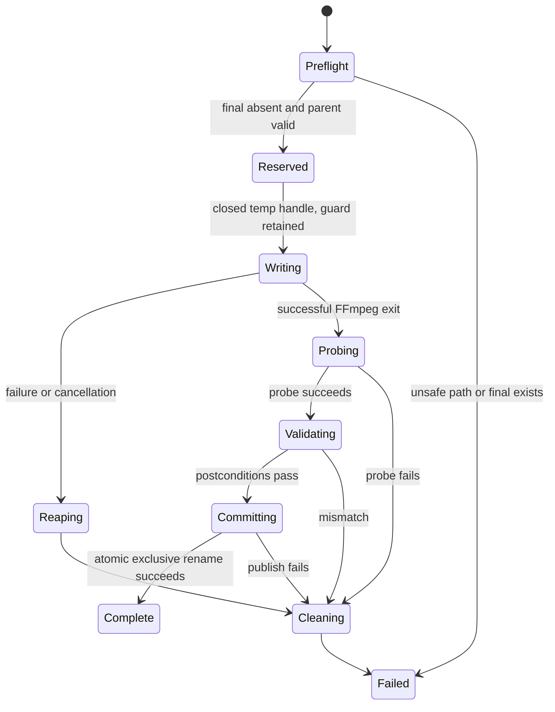

# M3 design: FFmpeg execution and safe output transaction

- Status: Accepted
- Date: 2026-08-11
- Milestone: M3

## Scope

M3 turns an accepted `JobPlan` into one validated Matroska output. It implements:

1. the object-safe backend port described by ADR-0005;
2. deterministic FFmpeg argument generation;
3. bounded machine-readable progress and diagnostics;
4. cancellation with process-group termination and explicit reaping;
5. same-parent temporary output, post-write validation, atomic exclusive commit,
   and cleanup on every non-success path;
6. a generated five-second DTS integration fixture whose copied video packet
   payloads are verified bit-for-bit.

M3 does not add user-facing CLI conversion commands, batch scheduling,
configuration discovery, in-place replacement, overwrite mode, TUI, or GUI.
Those remain later milestones. The backend accepts explicit `ffmpeg` and
`ffprobe` executable paths; discovery and `doctor` capability reporting remain
M4 work.

## Crate boundary

M3 adds `crates/backend` as specified by ADR-0005. `sonicmux-runtime` owns the
output transaction and structural validation. `sonicmux-ffmpeg` owns only the
external process protocol.

```text
sonicmux-backend
├── MediaBackend
├── BackendExecution
├── BackendReport / BackendError
└── ProgressEvent

sonicmux-ffmpeg
├── FFprobe adapter
├── JobPlan -> Vec<OsString>
├── progress parser
└── process-group lifecycle

sonicmux-runtime
├── preflight
├── temporary-file guard
├── post-write validation
└── atomic exclusive commit
```

`FfmpegCliBackend` changes from one executable path to a named pair, avoiding two
easy-to-swap `PathBuf` parameters:

```rust
pub struct FfmpegToolchainPaths {
    ffmpeg: PathBuf,
    ffprobe: PathBuf,
}

pub fn new(paths: FfmpegToolchainPaths) -> Self;
```

No workspace crate invokes a shell or constructs a command string. Argument
tests compare `Vec<OsString>` values, which also preserves non-UTF-8 paths on
Unix and native wide paths on Windows.

## Backend port and reports

The complete trait is the one proposed in ADR-0005. `probe` gains a cancellation
token; the existing inherent FFprobe API remains available as a typed adapter
boundary and is called by the trait implementation.

Progress uses integers and fixed-point values:

```rust
pub struct ProgressSnapshot {
    pub out_time_us: Option<i64>,
    pub total_size_bytes: Option<u64>,
    pub speed_milli: Option<u32>, // 1_000 == 1.0x
    pub frame: Option<u64>,
    pub dropped_frames: Option<u64>,
}

pub enum ProgressEvent {
    Started,
    Advanced(ProgressSnapshot),
    Finished(ProgressSnapshot),
}
```

Signed output time retains legitimate negative starting timestamps. Parsing a
decimal speed such as `1.37x` into thousandths avoids floating-point equality in
tests. Unknown progress keys are ignored at trace level. A successful report
contains elapsed wall time, the last complete progress record, and bounded
warnings; process exit status and stderr belong to failures rather than normal
machine output.

M3 adds the probed format duration to `JobPlan` so later presentation layers can
calculate a fraction from `out_time_us`. The backend does not calculate ETA or
clamp raw time. M5's aggregator owns display percentages, weighting, and ETA.

### M2 plan refinements required for execution

M2 intentionally stopped at an argument-neutral plan, but execution exposes two
facts that the current shape does not carry:

- `TargetLayout::KeepUpTo51` cannot become an exact `-ac` value without the
  source channel count;
- timing cannot be validated after execution unless the expected source timing
  is retained in the postconditions.

The pure planner therefore resolves and stores `output_channels: ChannelCount`
on every `EncodeAudio` operation. `AudioTarget` still records the requested
policy; the resolved count records its deterministic application to that exact
source stream. `ExpectedStream` also gains the stream kind and expected timing
facts, while `JobPlan` gains the optional format duration used for progress.
Attachment filename/MIME expectations remain represented by expected metadata.
No FFmpeg spelling enters core.

## Deterministic FFmpeg arguments

For a transcode or remux, the adapter builds the following logical argument
array. Bracketed lines are repeated from the typed plan and are never accepted as
raw user fragments.

```text
-hide_banner
-nostdin
-y
-progress pipe:1
-stats_period 0.25
-nostats
-copyts
-i INPUT
-map_metadata 0
-map_chapters 0
-copy_unknown
[-map 0:SOURCE_INDEX]...
-c copy
[-c:a:AUDIO_OUTPUT_ORDINAL ENCODER]...
[-b:a:AUDIO_OUTPUT_ORDINAL BITRATE]...
[-ac:a:AUDIO_OUTPUT_ORDINAL CHANNEL_COUNT]...
[-metadata:s:OUTPUT_ORDINAL KEY=VALUE]...
[-disposition:OUTPUT_ORDINAL FLAGS_OR_0]...
-copytb 1
-avoid_negative_ts disabled
-f matroska
STAGING_PATH
```

`-y` is safe here because `STAGING_PATH` is an unguessable file reserved and
owned by runtime. FFmpeg is never given the final output path. `-nostdin` also
prevents an inherited terminal from consuming UI input.

Every output operation emits one exact `-map 0:<index>` in plan order. Duplicate
source mappings are intentional in `add` mode. Global `-c copy` is the baseline;
only `EncodeAudio` operations receive an indexed audio encoder, bitrate, and
channel count:

| Target | FFmpeg encoder | Channel rule |
| --- | --- | --- |
| AC-3 | `ac3` | stereo = 2, 5.1 = 6, keep = `min(source, 6)` |
| E-AC-3 | `eac3` | stereo = 2, 5.1 = 6, keep = `min(source, 6)` |
| AAC | `aac` | stereo = 2, 5.1 = 6, keep = `min(source, 6)` |

This means no video or subtitle encoder option can be generated. Attachments,
data, compatible audio, and every non-audio stream remain stream copies.

FFmpeg normally copies per-stream metadata with each mapped stream. M3 relies on
that behavior for arbitrary retained source tags and explicitly emits the
planned language/title values for encoded derivatives. Metadata keys or values
that cannot be represented safely as one FFmpeg `key=value` argument are not
silently rewritten: automatic source copying is retained and a bounded warning
is reported. Validation checks the expected values afterward.

Every output stream receives an explicit disposition argument, including `0`
for an empty set. This prevents FFmpeg's automatic “first stream of each type is
default” behavior from changing the plan. Enabled known and retained unknown
flags are joined with `+` in stable order; rejection by the selected FFmpeg is a
typed execution failure rather than silent loss.

`-map_metadata 0` and `-map_chapters 0` preserve global metadata and chapters.
`-copy_unknown` allows planned unknown/data stream types to be copied. The
combination `-copyts -copytb 1 -avoid_negative_ts disabled` avoids intentional
timestamp rebasing and retains the input demuxer time base for stream-copy
streams. M3 does not use `-start_at_zero`, `-shortest`, timestamp offsets, or
frame-rate conversion options.

At least eight reviewed snapshots cover add, replace, only-new, remux-only,
multiple derivatives, metadata/dispositions, negative/non-UTF-8 paths where the
platform permits them, and validation of a rejected malformed plan. Snapshots
redact executable, input, and staging paths but do not flatten the arguments to
a shell string.

## Progress and diagnostic protocol

FFmpeg standard output is exclusively `-progress pipe:1`. It emits `key=value`
records terminated by `progress=continue` or `progress=end`. M3 reads standard
output and standard error concurrently so neither pipe can block the process.

- each line is capped at 16 KiB;
- unknown keys are ignored;
- malformed known numeric values produce a protocol error with the key name but
  not unbounded raw output;
- progress delivery uses `try_send` on a bounded channel so a slow UI cannot
  stall FFmpeg; intermediate snapshots may be coalesced and the operation future
  remains the authoritative source of started/finished state;
- the most recent complete snapshot is always retained in the backend task;
- `progress=end` is required for a normal successful protocol completion;
- stderr is retained as a rolling 256 KiB tail and may be streamed line-by-line
  at debug level without logging arbitrary metadata at normal verbosity.

A non-zero exit returns a typed error containing the exit code or terminating
signal where available and the bounded stderr tail. Launch, missing pipe, read,
oversized line, malformed progress, wait, group termination, and cancellation
are distinct error categories. No error embeds an unbounded command output.
Any reader/protocol failure triggers the same group-kill and explicit-wait path
before the error is returned.

## Cancellation and process ownership

FFmpeg is spawned in an owned process group with `command-group`'s Tokio support:
a POSIX process group on Linux/macOS and a Job Object on Windows. This preserves
ADR-0001's process-tree cancellation contract without adding unsafe code to a
SonicMux workspace crate.

On Windows the command is also created without a console window, so TUI/GUI use
does not flash a separate terminal. This platform-specific flag is applied
through the process builder rather than through a shell.

The process task races completion against `CancellationToken::cancelled()`:

1. cancellation stops accepting progress as success;
2. the whole process group is killed;
3. the child is explicitly awaited and both reader tasks are joined;
4. only after reaping does the backend return `BackendError::Cancelled`;
5. runtime then drops the staging guard, removing the partial output.

`kill_on_drop(true)` is a last-resort leak guard, not the normal cancellation
path. Dropping the future or child handle is never treated as successful
termination. A child cancellation token is used per operation so M5 can later
cancel one file or a complete batch without changing this interface.

## Safe output transaction

Runtime executes one output through this state machine:



Preflight requires an existing local output parent directory and rejects an
existing final path, including a symlink. Runtime creates a private random
temporary directory inside that exact parent and a `NamedTempFile` with suffix
`.tmp.mkv` inside it. It converts the file to a `TempPath` so its open handle is
closed before FFmpeg starts (required on Windows), while retaining both RAII
guards. The private directory narrows path-substitution races; the random file is
the only path passed to the backend.

Blocking create, metadata, sync, and publish operations run in
`spawn_blocking`. After FFmpeg closes the file, runtime rejects a missing,
symlinked, non-regular, or empty staging file, probes it through the backend, and
validates it. The completed file is synced before publication.

Publication uses `renamore::rename_exclusive(staging_path, final_path)`. On Linux
it selects `renameat2(RENAME_NOREPLACE)`, on macOS the exclusive Darwin rename,
and on Windows a non-replacing `MoveFileExW`. This is one atomic namespace
operation and cannot replace a destination created after preflight. The
non-atomic fallback API is deliberately not used. If the operating system or
filesystem cannot provide atomic exclusive rename, M3 returns
`AtomicCommitUnsupported` and removes the staging output; network and unusual
filesystems therefore receive no weaker silent behavior.

The `TempPath` guard is dropped on launch failure, non-zero exit, cancellation,
pipe/protocol failure, validation mismatch, or commit failure. Cleanup errors are
attached to the primary error. SonicMux never retries cleanup with a broader or
more destructive operation.

M3 has no overwrite or in-place route. An existing final output is always
`OutputExists`, even if it appears valid. Valid-output skip semantics and the
recoverable `.bak` transaction will be designed with their user-facing options
in later milestones.

## Post-write validation

Runtime compares the probed staging file with `JobPlan::expected()` before the
final name becomes visible. Validation is a pure comparison returning a
structured list of mismatches:

- exact output stream count and order;
- exact planned codec family for encoded streams and source codec for copies;
- every expected metadata key/value, while allowing muxer-added tags to be
  reported rather than treated as corruption;
- exact enabled disposition set;
- global metadata expected from the input;
- chapter count, tags, and rational start/end times;
- attachment count plus expected filename and MIME type;
- copied stream start times/durations within one output time-base tick;
- encoded audio start time within one audio sample and end duration within one
  codec frame, with the applied tolerance recorded in the report.

Chapter and stream time bases may be rewritten by Matroska. Validation therefore
compares rational time values by cross multiplication, with the stated one-tick
tolerance where muxer quantization is possible, rather than requiring identical
numerator/denominator fields.

No normal run hashes a multi-gigabyte video stream: structural validation remains
bounded to the probe pass. The integration test separately proves the stream-copy
argument contract by comparing the ordered SHA-256 hash of every video packet
payload before and after conversion.

## Tests

Unit and fixture tests do not require FFmpeg unless explicitly marked as media
integration tests.

### Argument and progress tests

- all output modes and remux-only produce exact ordered argument arrays;
- every non-audio stream remains under the global copy codec;
- per-audio ordinal options still target the correct track with interleaved
  video/subtitle streams;
- all dispositions, including an empty set and retained future flags, are
  explicit;
- progress handles CRLF, partial reads, unknown keys, negative time, `N/A`, and
  `progress=end`;
- oversized and malformed known fields fail with bounded diagnostics;
- a full progress channel does not block parsing.

### Runtime transaction tests with a mock backend

- success validates and publishes exactly one final file;
- an existing destination prevents backend execution;
- a destination created after preflight wins and is not overwritten;
- backend failure, cancellation, invalid output, failed probe, and validation
  mismatch remove the staging file;
- cleanup happens only after the mock process reports it has been reaped;
- a commit failure keeps the original destination intact;
- the backend sees a staging path in the final parent, never the final path.

### Generated FFmpeg integration test

`testdata/generate-m3-fixture.sh` creates, rather than commits, a five-second MKV
containing deterministic synthetic video and DTS audio. The generator uses the
native experimental DTS encoder when available and skips with an explicit
reason otherwise. A test then:

1. probes and plans DTS -> AC-3 in `add` mode;
2. executes through the real safe-output transaction;
3. checks that the original DTS and new AC-3 tracks are present in plan order;
4. checks metadata, dispositions, chapters, and timing postconditions;
5. obtains video packet hashes with FFprobe `-show_packets -show_data_hash sha256`;
6. compares the complete ordered input/output video hash sequence;
7. asserts that no temporary file remains.

Real-media tests are gated by `SONICMUX_RUN_FFMPEG_TESTS=1`. CI has one Ubuntu
job with a known FFmpeg installation that enables the gate. Unit, parser,
argument, and mock-runtime tests stay deterministic on all three operating
systems. Windows is the first manual end-to-end validation target and must cover
successful commit, cancellation, destination collision, and absence of a
console-window/process leak before M3 is accepted as implemented.

## Dependencies introduced by M3

Versions are resolved and locked during implementation, subject to the workspace
MSRV and license checks:

- `async-trait 0.1.91` for the dyn-compatible port;
- `tokio-util 0.7.19` for hierarchical cancellation tokens;
- `tempfile 3.27.0` for private same-parent RAII staging;
- `renamore 0.3.2` for atomic, non-replacing rename on the three target operating
  systems;
- `command-group 5.0.1` with Tokio support for POSIX process groups and Windows
  Job Objects.

All are used behind narrow internal modules. Production workspace source keeps
`#![forbid(unsafe_code)]`.

Protocol and API choices were checked against the current
[FFmpeg manual](https://ffmpeg.org/ffmpeg.html),
[FFprobe manual](https://ffmpeg.org/ffprobe.html),
[`async-trait` documentation](https://docs.rs/async-trait/0.1.91/async_trait/),
[`CancellationToken` documentation](https://docs.rs/tokio-util/0.7.19/tokio_util/sync/struct.CancellationToken.html),
[`tempfile` path-guard documentation](https://docs.rs/tempfile/3.27.0/tempfile/struct.TempPath.html),
[`renamore` exclusive-rename documentation](https://docs.rs/renamore/0.3.2/renamore/fn.rename_exclusive.html),
and [`command-group` documentation](https://docs.rs/command-group/5.0.1/command_group/).

## Definition of Done

M3 is complete when:

- ADR-0005 and the accepted architecture amendments are applied;
- `sonicmux-backend`, the FFmpeg executor, progress parser, cancellation, safe
  output transaction, and validation are implemented;
- no shell, lossy path conversion, unbounded pipe buffering, direct final-path
  write, implicit overwrite, or production panic is present;
- argument snapshots and progress protocol fixtures are reviewed;
- mock transaction tests cover every cleanup edge above;
- the generated DTS integration test converts successfully and proves copied
  video packet payload equality;
- Windows receives the first documented manual execution check;
- `cargo fmt --all --check` passes;
- `cargo clippy --workspace --all-targets --all-features -- -D warnings` passes;
- `cargo test --workspace` passes;
- the gated real-FFmpeg integration job passes in CI.

## Approval points

Approval of this M3 design accepts these refinements:

1. add `sonicmux-backend` to remove the runtime/adapter dependency cycle;
2. use `async-trait` and an owned `BackendExecution` for an injectable dyn port;
3. pass a runtime-owned staging path separately from the plan's final output;
4. resolve concrete derivative channel counts in the pure plan and retain the
   duration/timing facts required by progress and validation;
5. use explicit per-stream dispositions and rely on mapped-stream metadata copy
   plus explicit derivative language/title overrides;
6. preserve timestamps with `-copyts -copytb 1 -avoid_negative_ts disabled` and
   validate rational timing with documented muxer/codec tolerances;
7. use bounded lossy intermediate progress delivery while retaining the latest
   complete backend snapshot;
8. use a POSIX process group or Windows Job Object and always kill, wait, then
   clean on cancellation;
9. publish from a private same-parent staging directory with atomic
   `rename_exclusive`, never use its non-atomic fallback, and fail safely on an
   unsupported filesystem;
10. treat an existing final path as an error in M3; skip/overwrite/in-place
   behavior remains later work;
11. prove copied video payload equality only in the generated integration test,
    avoiding an expensive packet-hash pass during every normal conversion.
